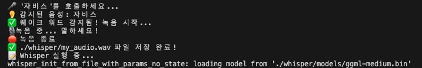

# 🎙️ AI Voice Assistant (자비스)

> Whisper + Spring Boot + OpenAI API 기반 AI 음성 비서

이 프로젝트는 **Whisper STT(Speech-to-Text), Spring Boot, OpenAI API, TTS(Text-to-Speech)** 를 활용하여 사용자의 음성을 인식하고 AI 응답을 제공하는 **음성 비서**입니다.  

**"자비스"** 라고 말하면 AI가 동작하여 **음성을 텍스트로 변환(STT) → AI 응답 생성 → 음성 변환(TTS) 후 출력**합니다. 🚀  

**가능 OS는 MAC이며 모델은 medum을 사용했습니다.**
## **Whisper 성능 비교 (모델 크기별)**
| 모델 | 크기 | 속도 | 정확도 | 권장 |
| --- | --- | --- | --- | --- |
| `tiny` | 75MB | 매우 빠름  | 낮음 | X |
| `base` | 142MB | 빠름 | 보통 | X |
| `small` | 466MB | 중간 | 좋음 | X |
| **`medium`** | 1.5GB | 느림  | **매우 좋음** | ✅ |
| **`large-v3`** | 3GB | 매우 느림  | **최고 정확도** | ✅ |


</br>

## 📌 **기능**
✅ **"자비스"라고 부르면 자동으로 음성 인식 시작**  
✅ **Whisper STT 모델을 이용해 음성을 텍스트로 변환**  
✅ **Spring Boot API로 변환된 텍스트 전송 후 AI 응답 받기**  
✅ **TTS(Text-to-Speech) 변환 후 음성으로 출력**  
✅ **OpenAI API 연동으로 더 자연스러운 대화 가능**  
✅ **날씨 API, 일정 관리, IoT 연동 등 다양한 확장 가능**  


## 🛠 **기술 스택**
### **🔹 백엔드 (Spring Boot)**
- **Spring Boot 3.4.3** (REST API)
- **OpenAI API** (AI 응답 생성)
- **OpenWeather API** (날씨 정보)
- **Java 21** (Lombok 활용)
- **Whisper.cpp** (STT: 음성 → 텍스트 변환)
- **SpeechRecognition + PyAudio** (음성 감지)
- **Requests (Spring Boot API 연동)**
- **gTTS 또는 pyttsx3** (TTS: 텍스트 → 음성 변환)

---

## 🚀 **설치 및 실행 방법**

### **1️⃣ GitHub에서 프로젝트 클론**
```bash
git clone https://github.com/사용자명/AI-Voice-Assistant.git
cd whisper
```


### **2️⃣ Whisper 빌드 및 모델 다운로드**
cmake 설치
```bash
brew install cmake
```
Whisper 중간 모델 다운로드:
```bash
curl -L -o models/ggml-medium.bin https://huggingface.co/ggerganov/whisper.cpp/resolve/main/ggml-medium.bin
```
```bash
cd whisper
mkdir build
cd build
cmake ..
make -j4
```

### **3️⃣ Python 패키지 설치**
**portAudio 설치**
```bash
brew install portaudio
pip install --global-option='build_ext' --global-option='-I/opt/homebrew/include' --global-option='-L/opt/homebrew/lib' pyaudi
```

**Python 모든 패키지 설치**
```bash
pip install speechrecognition pyaudio numpy requests pyttsx3 gtts
```

### **4️⃣ Spring Boot 서버 실행**
```bash
cd backend
./gradlew bootRun
```

### **5️⃣ AI 비서 실행 (Python)**
```bash
python wake_word_whisper.py
```

</br>

# 🎤 사용 방법
1️⃣ "자비스"라고 부르면 자동으로 음성 인식 시작 </br>
2️⃣ Whisper가 음성을 텍스트로 변환 후 Spring Boot 서버에 전송 </br>
3️⃣ Spring Boot에서 OpenAI API를 호출하여 AI 응답 생성 </br>
4️⃣ AI 응답을 받아 Python에서 TTS로 변환 후 음성 출력 </br>

# 결과


